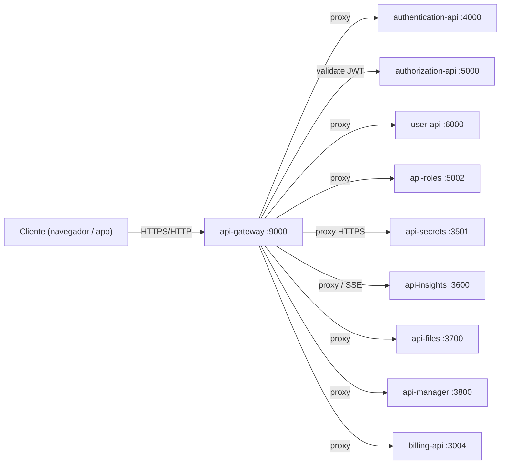
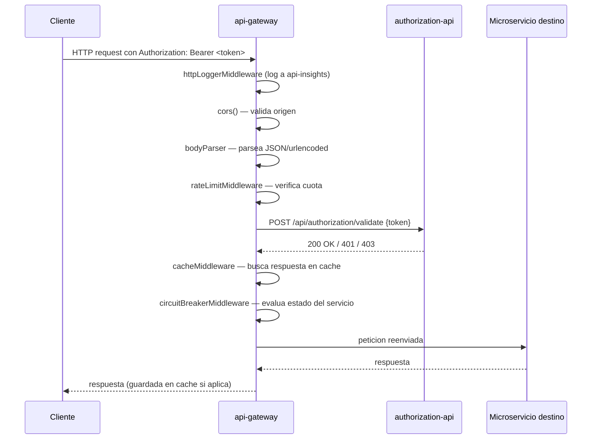

# dev-laoz-api-gateway

Punto de entrada unico para todo el trafico externo del ecosistema Dev Laoz. Recibe cada peticion HTTP, aplica una cadena de middlewares (logging, CORS, rate limiting, autenticacion y cache) y la reenvía al microservicio correspondiente mediante un circuit breaker. Expuesto en el puerto `9000` del host; internamente escucha en el puerto `3002`.

## Posicion en la arquitectura



## Flujo de negocio



## Stack tecnico

| Componente | Libreria / Version |
| --- | --- |
| Runtime | Node.js 18+ |
| Framework | Express.js |
| Proxy | http-proxy-middleware |
| Circuit breaker | opossum (via @dev-laoz/core) |
| Cache | node-cache (TTL 60 s) |
| Rate limiting | @dev-laoz/core rateLimitMiddleware |
| Variables de entorno | dotenv |
| Parsing | body-parser |

## Prerrequisitos

- Node.js 18 o superior
- Acceso de red a todos los microservicios destino (en Docker: misma red)
- Los servicios `authorization-api` y `api-insights` deben estar activos para que el gateway funcione correctamente

## Variables de entorno

| Variable | Descripcion | Valor en Docker |
| --- | --- | --- |
| `LOCAL_PORT` | Puerto interno del proceso | `3002` |
| `CORS_ORIGIN` | Origen permitido por CORS | `http://localhost:8080` |
| `NODE_ENV` | Entorno de ejecucion | `production` |

## Instalacion y ejecucion local

```bash
# Instalar dependencias
npm install

# Desarrollo con recarga automatica
npm run dev

# Produccion
npm start
```

El servicio iniciara en `http://localhost:3002`. Para acceder desde fuera del entorno Docker exponer el puerto `9000`.

## Endpoints

El gateway no tiene controladores propios: cada ruta `/api/*` se delega al microservicio configurado en `src/config/services.json`.

| Metodo | Ruta | Auth | Descripcion |
| --- | --- | --- | --- |
| GET | `/health` | No | Healthcheck del gateway |
| POST | `/api/auth/login` | No | Inicio de sesion (→ authentication-api) |
| POST | `/api/auth/refresh` | No | Renovar token JWT (→ authentication-api) |
| POST | `/api/auth/logout` | Si | Cerrar sesion (→ authentication-api) |
| GET | `/api/auth/verify` | Si | Verificar token (→ authentication-api) |
| POST | `/api/authorization/validate` | Si | Validar permisos (→ authorization-api) |
| GET | `/api/user` | No | Listar usuarios (→ user-api) |
| POST | `/api/user` | No | Registrar usuario (→ user-api) |
| GET/PUT/DELETE | `/api/user/:id` | Si | Operaciones sobre usuario (→ user-api) |
| GET/POST | `/api/roles` | Si | Listar / crear roles (→ api-roles) |
| POST | `/api/roles/check` | No | Verificacion interna de roles (→ api-roles) |
| GET/PUT/DELETE | `/api/roles/:id` | Si | Operaciones sobre rol (→ api-roles) |
| POST | `/api/secrets` | Si | Gestion de secretos HTTPS (→ api-secrets:3501) |
| POST | `/api/insights` | No | Ingestion de eventos (→ api-insights) |
| GET | `/api/insights` | Si | Consulta de eventos (→ api-insights) |
| GET | `/api/insights/stream` | Si | Stream SSE — bypass de circuit breaker (→ api-insights) |
| GET/POST/PUT/DELETE | `/api/files` | Si | Gestion de archivos (→ api-files) |
| GET/POST | `/api/manager` | Si | Gestion de contenedores y repos (→ api-manager) |
| GET/POST | `/api/billing` | Si | Pagos y suscripciones (→ billing-api) |

> **Nota SSE:** `/api/insights/stream` utiliza `http-proxy-middleware` directamente y omite el circuit breaker para mantener la conexion persistente.

## Integracion con otros servicios

- **authorization-api** — cada peticion autenticada realiza un POST interno a `/api/authorization/validate` antes de llegar al servicio destino.
- **api-insights** — `httpLoggerMiddleware` envia un registro de cada peticion HTTP.
- **Todos los demas servicios** — el gateway actua como unico punto de contacto; los clientes nunca llaman a los microservicios directamente.

## Swagger / API Docs

El gateway es un proxy puro y no genera documentacion Swagger propia. La documentacion de cada API se encuentra en el `docs/API.md` del servicio correspondiente y en su endpoint `/api-docs` (cuando esta habilitado).

Para la tabla completa de rutas del gateway ver `docs/API.md`.
